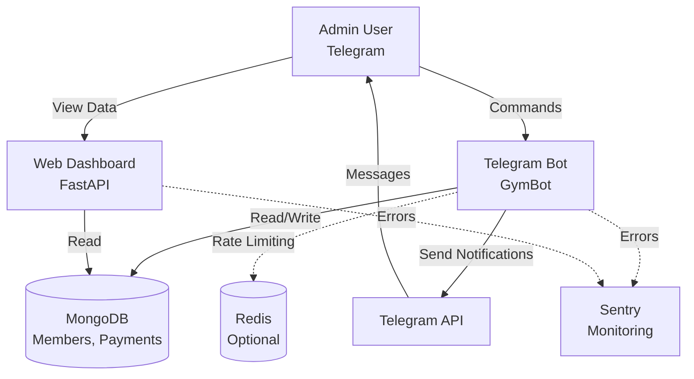
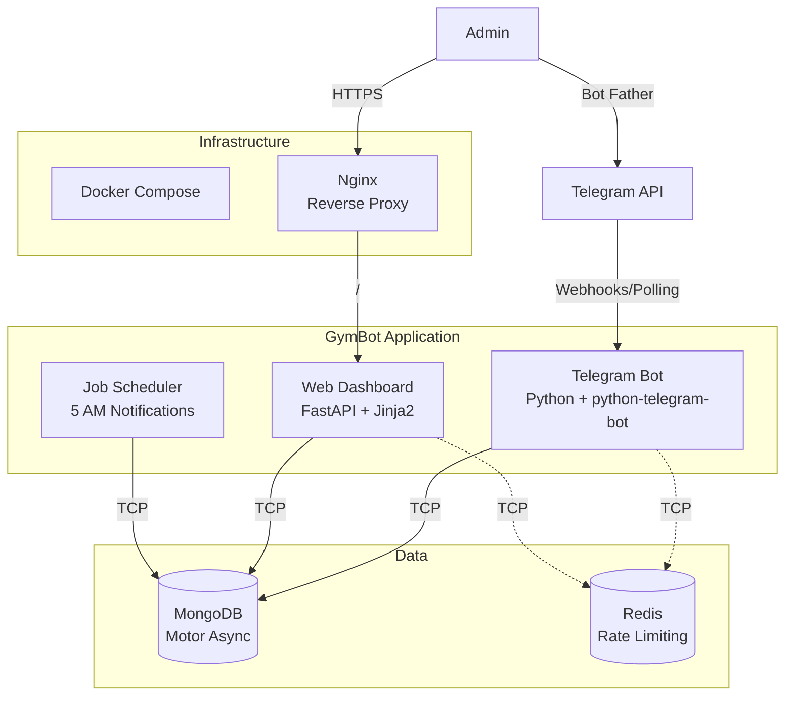
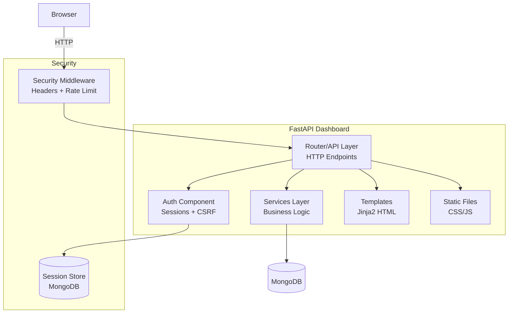
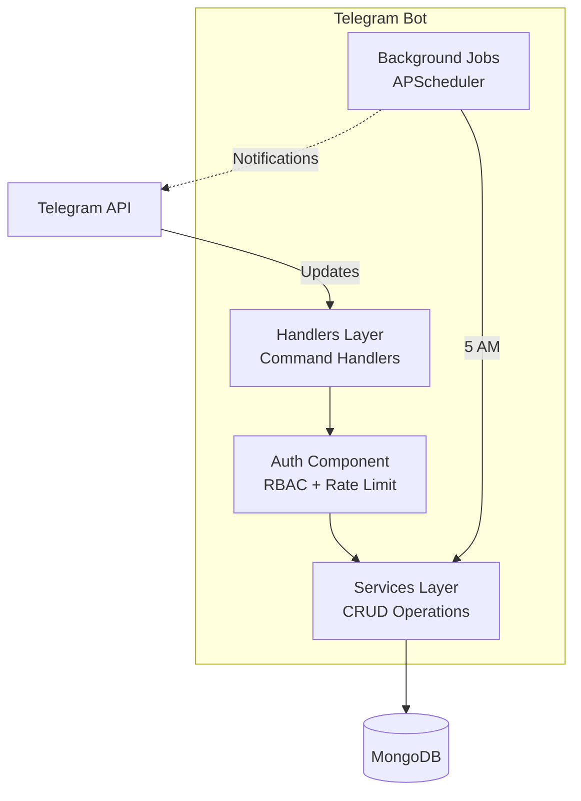
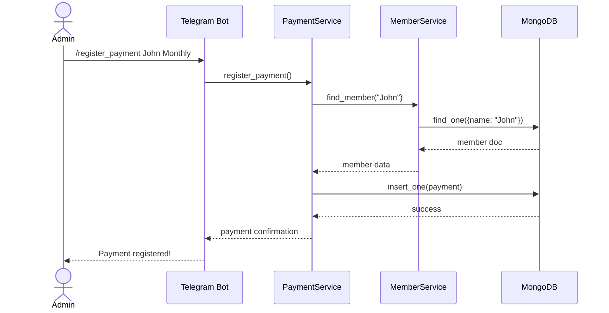
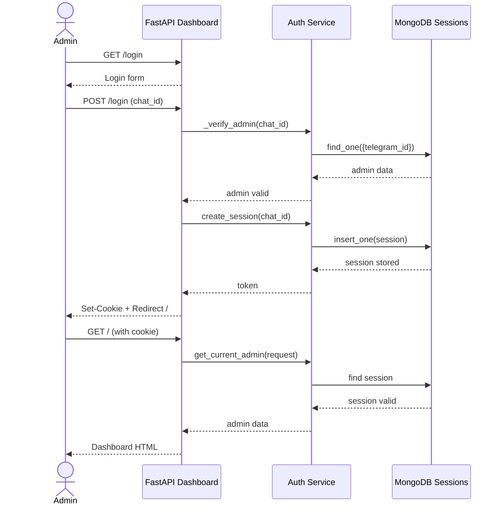

# C4 Architecture Diagrams - GymBot

## Level 1: System Context Diagram

## Level 2: Container Diagram

## Level 3: Component Diagram (Dashboard)

## Level 3: Component Diagram (Bot)

## Data Flow Diagram - Payment Registration

## Data Flow - Dashboard Authentication

## Legend

- **Solid line**: Synchronous/HTTP communication
- **Dotted line**: Asynchronous/Background communication
- **Cylinder**: Database/Storage
- **Rectangle**: Component/Service
- **Actor**: External user
